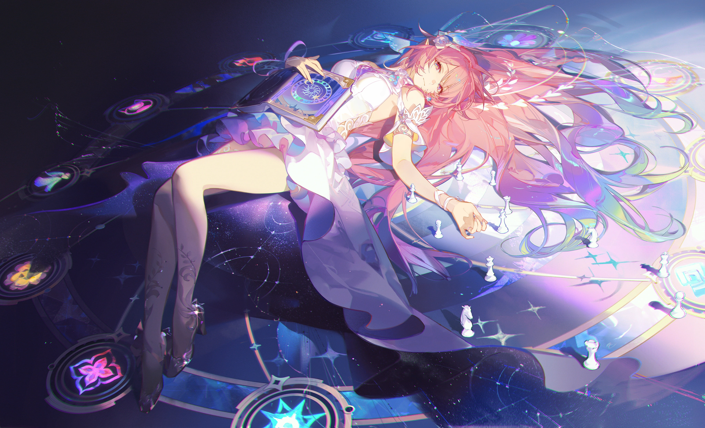

  

 

  

<table align="center">
<table align="center">
<tr>
<td align="center" valign="middle">

</td>
<td valign="middle">
<code>&gt; INCOMING TRANSMISSION</code> 
<code>&gt; FROM: ASTRAL EXPRESS PARLOR CAR</code> 
<code>&gt; MSG: "Welcome aboard, Trailblazer!</code> 
<code>&nbsp;&nbsp;&nbsp;&nbsp;&nbsp;&nbsp;&nbsp;&nbsp;&nbsp;May this journey lead us starward."</code>
</td>
</tr>
</table>

## 🌌 &nbsp;TRAILBLAZER PROFILE&nbsp; 🌌

| PARAMETER | DATA |
|:--|:--|
| `NAME` | **Aditya Pallickara** · `DumbCoder02` |
| `AGE` | 20 Years Old |
| `ROLE` | Full Stack Developer & ML Explorer |
| `CURRENT FOCUS` | Machine Learning Algorithms + Full Stack Web Dev |
| `STAMINA SOURCE` | Gacha games + Late-night coding |
| `BUILDING` | Dynamic web frontends with intelligent ML backends |

## ⚙️ &nbsp;LIGHT CONE EQUIPMENT (TECH STACK)&nbsp; ⚙️

  

## 📂 &nbsp;EXPEDITION LOG (PROJECTS)&nbsp; 📂

| 📌 Project | 📝 Overview | 🏷️ Tech Stack |
|:--|:--|:--|
| **[Web App Platform](https://github.com/DumbCoder02)** | Dynamic full stack web application interface. | `React` `Node.js` `MongoDB` |
| **[ML Backend Service](https://github.com/DumbCoder02)** | Machine Learning backend integration pipeline. | `Python` `Machine Learning` |

## 🎭 &nbsp;FEATURED ART&nbsp; 🎭

## 📡 &nbsp;EXPEDITION STATS&nbsp; 📡

## 📞 &nbsp;EXPRESS FREQUENCY (CONTACT)&nbsp; 📞

  

  

